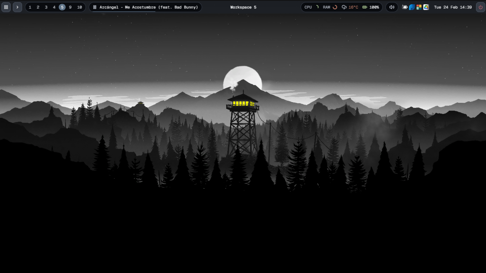
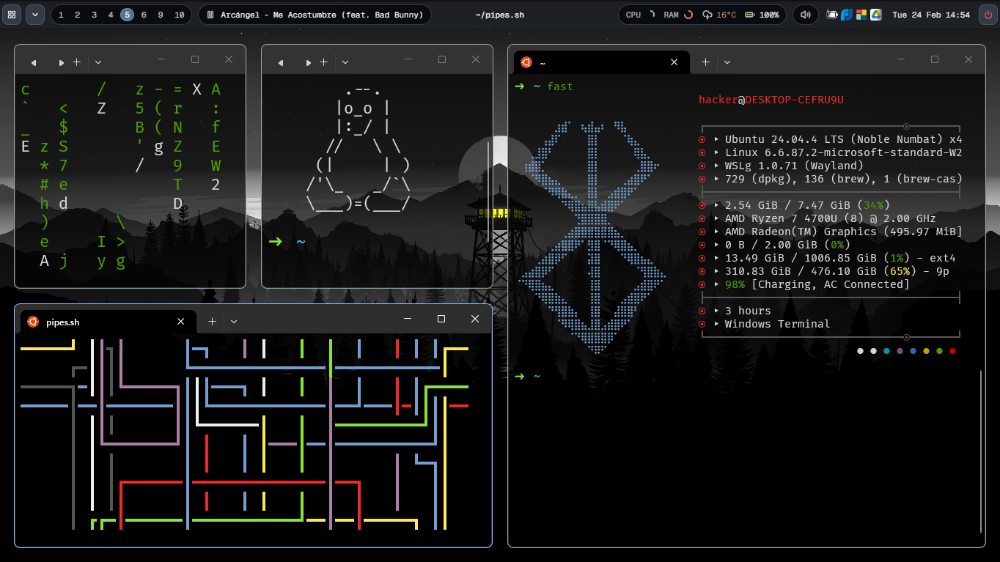
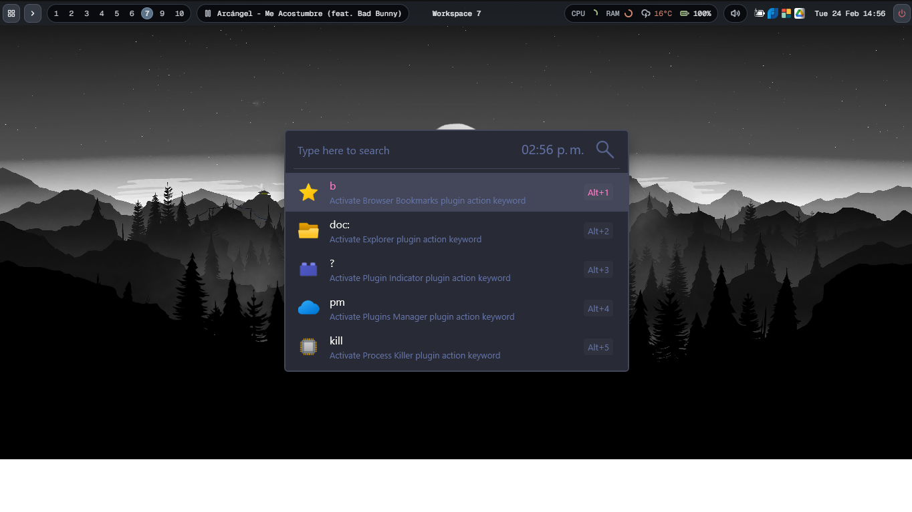
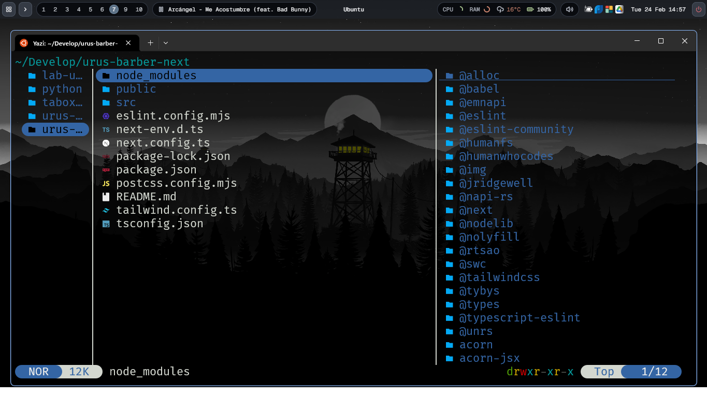
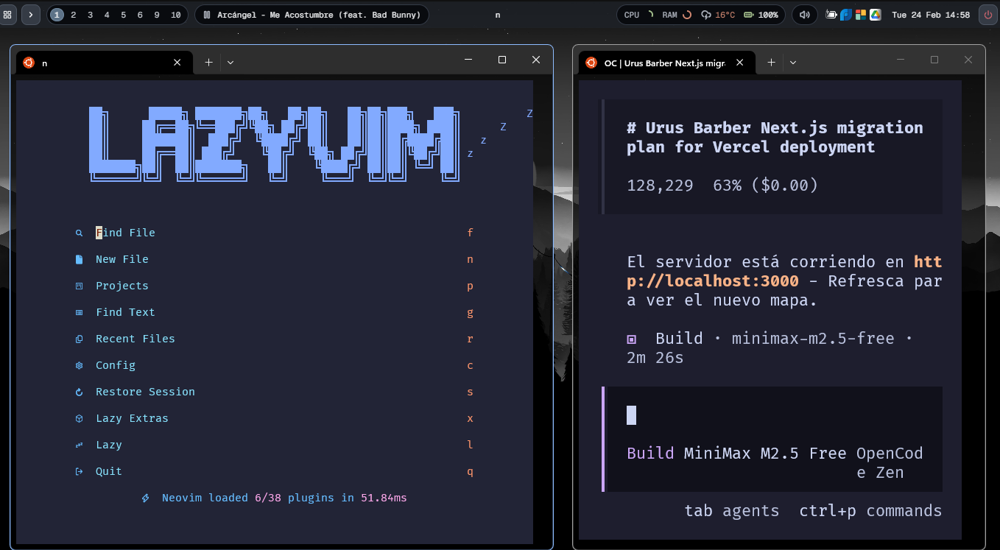

# GlazeWM + Zebar Configuration | Configuracion GlazeWM + Zebar

Personal Windows desktop setup with GlazeWM and Zebar.  
Configuracion personal de escritorio en Windows con GlazeWM y Zebar.

Official GlazeWM repository (repo oficial):  
https://github.com/glzr-io/glazewm

## Installation First | Instalacion Primero

### EN
1. Install GlazeWM from the official repository: https://github.com/glzr-io/glazewm
2. Copy `glazewm/config.yaml` to `%APPDATA%\glazewm\config.yaml`.
3. Copy your Zebar config (for your preferred layout/widgets).
4. Restart GlazeWM.

### ES
1. Instala GlazeWM desde el repo oficial: https://github.com/glzr-io/glazewm
2. Copia `glazewm/config.yaml` en `%APPDATA%\glazewm\config.yaml`.
3. Copia tu configuracion de Zebar (segun tu layout/widgets).
4. Reinicia GlazeWM.

## Screenshots | Pantallazos

### 1) Clean desktop | Escritorio limpio

### 2) Multi-terminal tiling | Tiling con multiples terminales

### 3) App launcher / quick search | Launcher / busqueda rapida

### 4) Terminal development flow | Flujo de desarrollo en terminal

### 5) Neovim + work panel | Neovim + panel de trabajo

## Keybindings | Atajos principales

| EN / ES Action | Binding |
|--------|-------|
| Open Windows Terminal / Abrir Windows Terminal | `Alt+Enter` |
| Open File Explorer / Abrir File Explorer | `Alt+E` |
| Open Chrome / Abrir Chrome | `Alt+B` |
| Focus (left/down/up/right) / Cambiar foco (izq/abajo/arriba/der) | `Alt+H/J/K/L` |
| Move window (left/down/up/right) / Mover ventana (izq/abajo/arriba/der) | `Alt+Shift+H/J/K/L` |
| Enable resize mode / Activar modo resize | `Alt+R` |
| Toggle floating | `Alt+Shift+Space` |
| Toggle fullscreen | `Alt+F` |
| Switch workspace / Cambiar workspace | `Alt+1` to `Alt+0` |
| Move window to workspace / Mover ventana a workspace | `Alt+Shift+1` to `Alt+Shift+0` |
| Close window / Cerrar ventana | `Alt+Q` |
| Pause bindings / Pausar bindings | `Alt+Shift+P` |
| Reload config / Recargar config | `Alt+Shift+R` |

## Requirements | Requisitos

- Windows 10/11
- GlazeWM (official repo / repo oficial): https://github.com/glzr-io/glazewm
- Zebar
- Windows Terminal
- Google Chrome

## Documentation | Documentacion

- GlazeWM config docs: https://github.com/glzr-io/glazewm?tab=readme-ov-file#config-documentation
